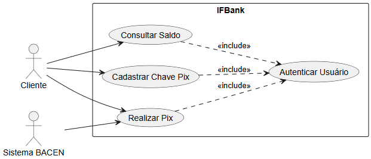
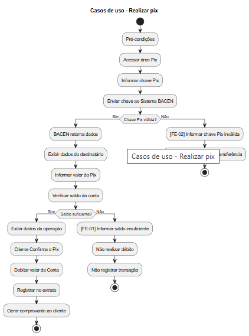
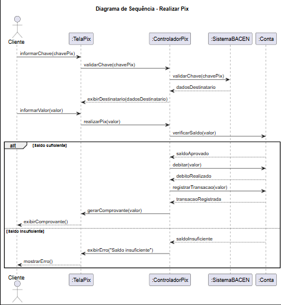
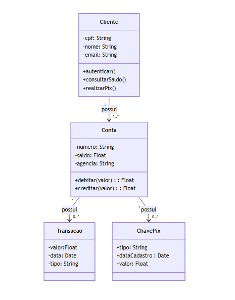

# DOSSIÊ DE ANÁLISE — IFBANK

## Módulo Pix

---

# Etapa 1 — Levantamento (Casos de Uso)

Esta etapa apresenta os atores e as principais funcionalidades do módulo Pix, além da descrição textual do caso de uso **Realizar Pix**.

## Atores

- **Cliente**
- **Sistema BACEN**

## Casos de Uso

- Autenticar Usuário
- Consultar Saldo
- Cadastrar Chave Pix
- Realizar Pix

## Diagrama de Casos de Uso

## Descrição Textual — Realizar Pix

**Ator principal:** Cliente  
**Ator secundário:** Sistema BACEN

**Objetivo:** Permitir que o cliente realize uma transferência Pix para um destinatário utilizando uma chave Pix válida.

### Pré-condições

- O cliente deve estar autenticado e logado no aplicativo IFBank.
- O cliente deve possuir uma conta ativa no IFBank.
- A conta do cliente deve estar habilitada para realizar transferências Pix.

### Pós-condições

- O valor da transferência é debitado da conta do cliente.
- A transação Pix é registrada no extrato da conta.
- Um comprovante da operação é gerado e apresentado ao cliente.

### Fluxo Principal

1. O cliente acessa a área Pix do aplicativo.
2. O sistema apresenta a opção de realizar um Pix.
3. O cliente informa a chave Pix do destinatário.
4. O sistema envia a chave Pix para o Sistema BACEN para validação.
5. O Sistema BACEN verifica a existência da chave Pix.
6. O Sistema BACEN retorna os dados do destinatário ao IFBank.
7. O sistema apresenta os dados do destinatário para conferência do cliente.
8. O cliente informa o valor que deseja transferir.
9. O sistema verifica o saldo disponível na conta do cliente.
10. O sistema identifica que o saldo é suficiente para realizar a transferência.
11. O sistema apresenta os dados da operação para confirmação.
12. O cliente confirma a realização do Pix.
13. O sistema debita o valor da conta do cliente.
14. O sistema registra a transação no extrato.
15. O sistema gera o comprovante da transferência.
16. O sistema apresenta o comprovante ao cliente.
17. O caso de uso é encerrado com a transferência realizada com sucesso.

### Fluxos de Exceção

#### [FE-01] Saldo Insuficiente

**A partir do passo 9 do fluxo principal:**

1. O sistema verifica o saldo disponível na conta.
2. O sistema identifica que o saldo é inferior ao valor informado pelo cliente.
3. O sistema não realiza o débito.
4. O sistema informa ao cliente que o saldo é insuficiente para realizar o Pix.
5. O cliente pode informar outro valor ou cancelar a operação.
6. Nenhuma transação é registrada no extrato.

#### [FE-02] Chave Pix Inválida

**A partir do passo 4 do fluxo principal:**

1. O sistema envia a chave Pix informada para o Sistema BACEN.
2. O Sistema BACEN verifica a chave e informa que ela não existe ou é inválida.
3. O sistema informa ao cliente que a chave Pix não foi encontrada.
4. A transferência não pode prosseguir.
5. O cliente pode informar uma nova chave Pix ou cancelar a operação.

---

# Etapa 2 — Interação (Diagrama de Sequência)

O diagrama representa a interação entre **Cliente, TelaPix, ControladorPix, Sistema BACEN e Conta** durante a realização do Pix.

A sequência apresenta a validação da chave Pix, o envio do valor, a verificação do saldo, o débito da conta, o registro da transação e a geração do comprovante.

Também são representados os dois possíveis resultados da verificação de saldo:

- Saldo suficiente;
- Saldo insuficiente.

## Diagrama de Sequência

---

# Etapa 3 — Estrutura (Diagrama de Classes)

O diagrama apresenta as principais classes envolvidas no módulo Pix:

- **Cliente**
- **Conta**
- **Transacao**
- **ChavePix**

As classes possuem atributos e métodos relacionados às funcionalidades do sistema.

## Cliente

### Atributos

- `cpf: String`
- `nome: String`
- `email: String`

### Métodos

- `autenticar()`
- `consultarSaldo()`
- `realizarPix()`

## Conta

### Atributos

- `numero: String`
- `saldo: Float`
- `agencia: String`

### Métodos

- `debitar(valor): Float`
- `creditar(valor): Float`

## Transacao

### Atributos

- `valor: Float`
- `data: Date`
- `tipo: String`

## ChavePix

### Atributos

- `tipo: String`
- `dataCadastro: Date`
- `valor: Float`

## Relacionamentos

- Um **Cliente** possui uma ou mais **Contas**.
- Uma **Conta** possui zero ou várias **Transações**.
- Uma **Conta** possui zero ou várias **Chaves Pix**.

## Diagrama de Classes

---

# Conclusão

O módulo Pix do IFBank é representado por três perspectivas complementares:

1. **Casos de Uso:** apresenta as funcionalidades e os atores envolvidos.
2. **Diagrama de Sequência:** apresenta a interação entre os elementos durante a realização do Pix.
3. **Diagrama de Classes:** apresenta a estrutura das principais entidades do sistema e seus relacionamentos.

Dessa forma, o modelo contempla o processo de realização de uma transferência Pix, desde a validação da chave do destinatário até o débito da conta, registro da transação e geração do comprovante.